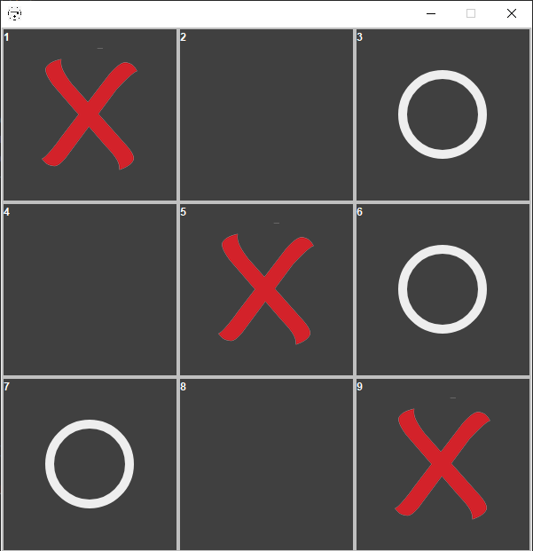

# TicTacToeGame-Java
A minimal GUI java retro Tic tac toe game
 
### Languages & tools :
[][java]
[][java]
  

|Tic Tac Toe Game Java|
|------|
||

### Directory Structure :

    |-- out
    |
    |-- src
    |   |-- com
    |       |-- tictactoe
    |           |-- GameLogic.java
    |           |-- Main.java
    |           |-- circle.png
    |           |-- cross.png
    |           |-- logo.png
    |
    |-- TicTacToeGame-Java.iml
    |
    |-- Img
    |    |-- java.png
    |    |-- intellij.png
    |    |-- ticTacToeJava.png
    |
    |-- README.md
## Connect with me:  

  
 

[website]: https://abhilashtuofficial.github.io/
[java]: https://github.com/AbhilashTUofficial/java-programming